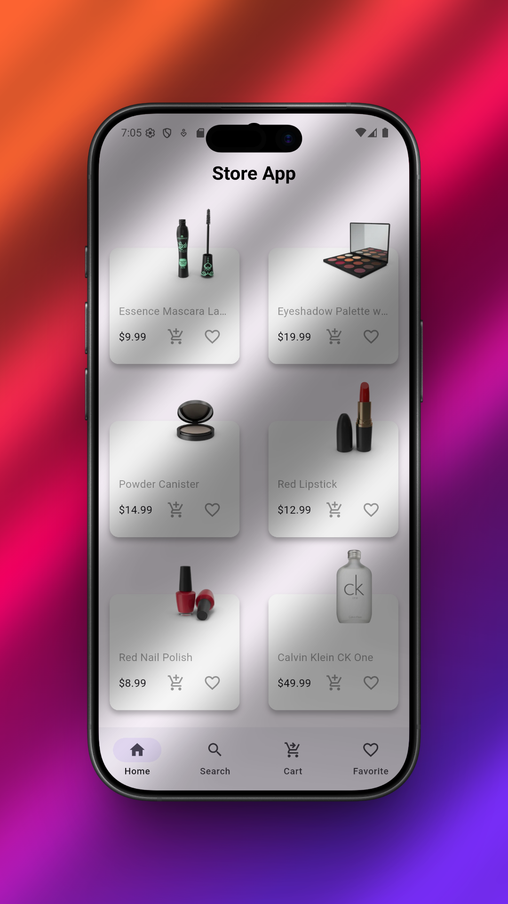
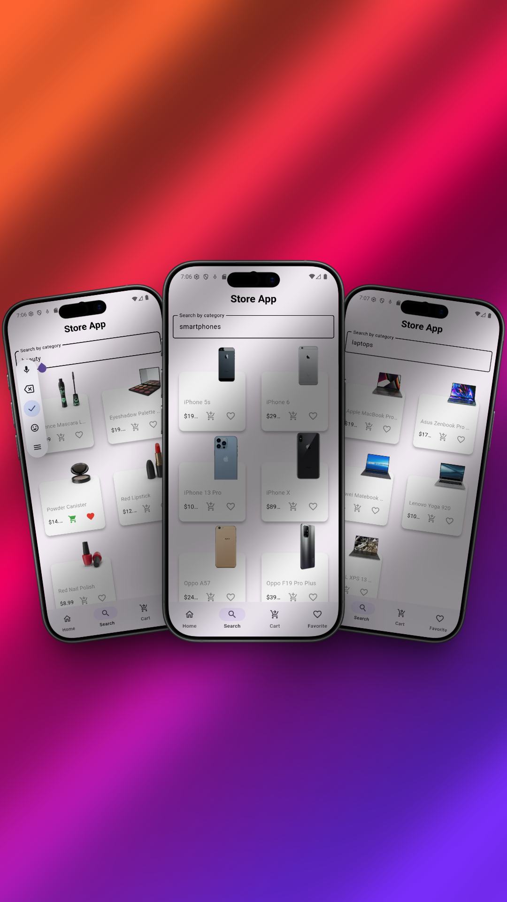
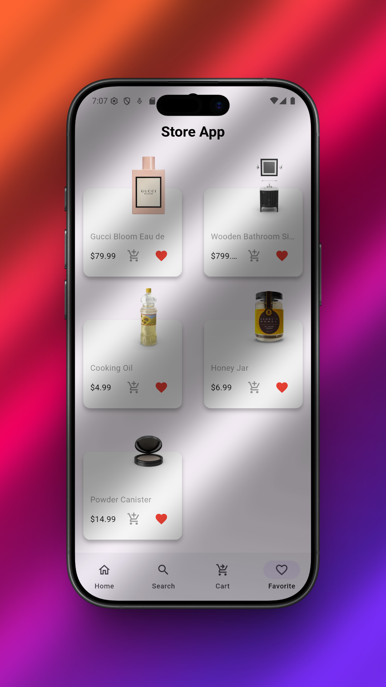
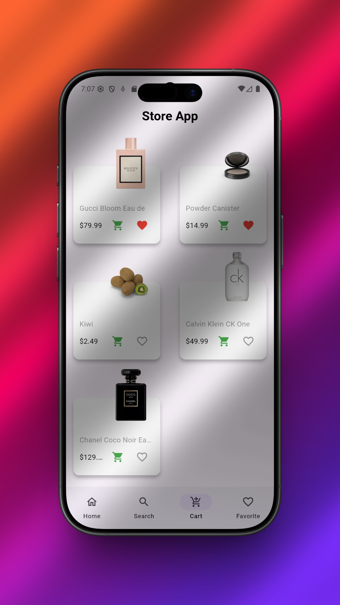
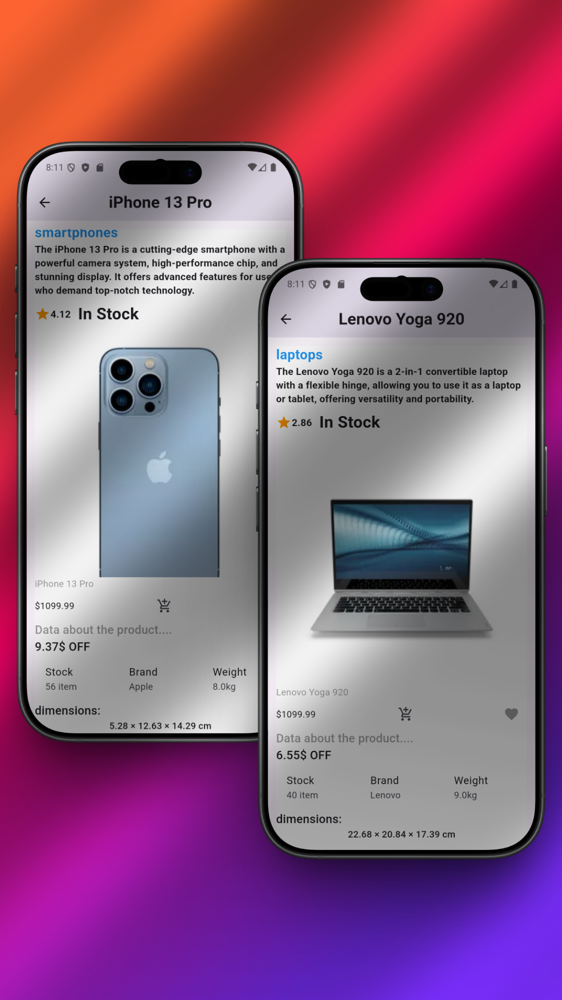

# 🛍️ Store App

A modern Flutter E-Commerce application built with **Flutter, Dart, BLoC/Cubit, Dio, REST APIs, and Firebase Firestore**.

The app allows users to browse products, explore categories, view detailed product information, search for products, manage favorites, and manage their shopping cart.

---
## 📱 Screenshots

### 🏠 Home

<p align="center">
  
</p>

<br>

<table>
  <tr>
    <td align="center">
      <b>🔎 Search</b>
      <br><br>
      
    </td>
    <td align="center">
      <b>❤️ Favorites</b>
      <br><br>
      
    </td>
  </tr>

  <tr>
    <td align="center">
      <b>🛒 Cart</b>
      <br><br>
      
    </td>
    <td align="center">
      <b>📱 Product Details</b>
      <br><br>
      
    </td>
  </tr>
</table>
---

## ✨ Features

- 🛍️ Display all products
- 🔎 Search for products
- 📂 Browse products by category
- 📄 View detailed product information
- ❤️ Add and remove favorites
- 🛒 Manage shopping cart
- 🔥 Store user-specific data using Firebase Firestore
- 🌐 Fetch products and categories from REST APIs
- 🔄 Update product data
- ⚡ State management using Cubit
- 🚨 Handle loading and error states
- 📱 Bottom navigation between application sections

---

## 🏗️ Project Structure

```text
lib/
│
├── cubits/
│   └── product_cubit/
│       ├── product_cubit.dart
│       └── product_cubit_states.dart
│
├── firestore/
│   └── firestore_service.dart
│
├── models/
│   └── product_model.dart
│
├── services/
│   ├── get_all_categories.dart
│   ├── get_all_products.dart
│   └── get_products_by_category.dart
│
├── views/
│   ├── taps/
│   │   ├── cart_tap.dart
│   │   ├── favorite_tap.dart
│   │   ├── home_tap.dart
│   │   ├── search_tap.dart
│   │   └── user_data_tap.dart
│   │
│   ├── display_products.dart
│   ├── home_view.dart
│   └── selected_product_card.dart
│
├── widgets/
│   ├── custom_textfield.dart
│   └── const.dart
│
├── firebase_options.dart
└── main.dart